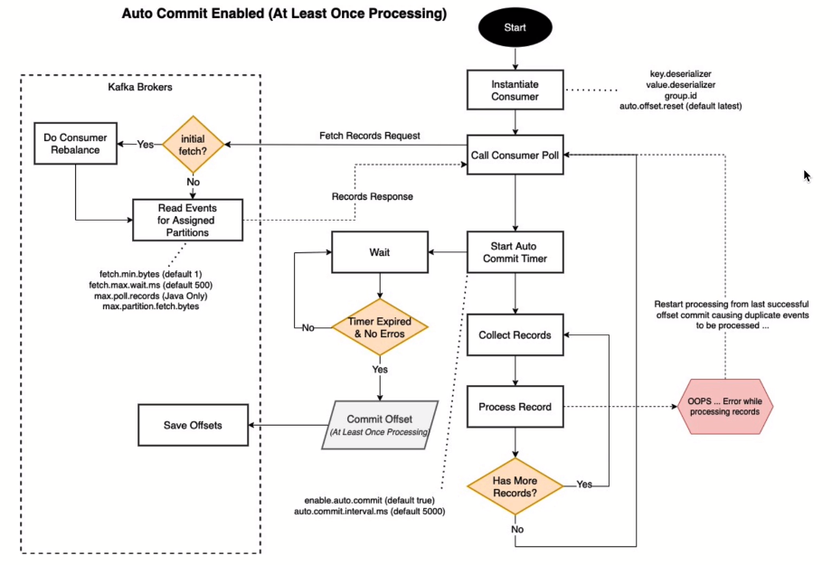

<details open>
  <summary><h2>Producer</h2></summary>
  
  <h3>Producers Influence Throughput via Partitions</h3>
  Producer client applications influence Kafka throughput scalability by distributing messages they produce across the available partitions assigned to the topic they are writing to.

  <br>

  <h4>Two Methods for Distributing Messages across Topic Partitions:</h4>
  <details>
    <summary><b>Message Key Hashing Algorithm</b></summary>
    <ul>
      <li><b>If a message key is specified</b> then the producer client performs a hash based calculation for aprtition assignment</li>
      <li>hash(key) % num partitions</li>
      <li>All messages that share the same key will be colocated in the same partition maintained in order of arrival to Kafka</li>
    </ul>
  </details>
  <details>
    <summary><b>Round Robin</b></summary>
    <ul>
      <li>If no message key is specified then the producer client distributes the messages it produces round robin style across the partitions</li>
    </ul>
  </details>
  
  

<details open>
<summary><h3>Detailed Overview of Kafka Producer</h3></summary>
    
  
<b>Config Parameters:</b>
* ```linger.ms```: recommended to set to preserve some resources (~100ms).

* ```batch.size```: By default, one record is sent at a time. ```batch.size``` can be changed to better utilize compute and network resources.  

* ```acks```: When data is written to a particular partition, by default, data will be replicated into the other replicas.
  <br>```acks = all``` for all brokers to be replicated (recommended)
  <br>```acks = 1``` will wait for leader to write the record to its local log only
  <br>```acks = 0``` for ```jesus take the wheel``` to not wait for any acknowledgements and continue (data will be lost).
* ```enable.idempotence```: To prevent duplication of the same data due to Producer-Broker connection issues, set ```enable.idempotence = 1```

* ```max.in.inflight.request.per.connection```: If data sequence is important, set ```max.in.inflight.request.per.connection = 1```

* ```retries```: defaulted to a reasonably significant value

* ```delivery.timeout.ms```: defaulted to a reasonably significant value
</details>

<details open>
  <summary><h2>Changing Partitions will Change Ordering</h2></summary>
  
    
</details>


</details>

<details open>
  <summary><h2>Consumer</h2></summary>

  <details open>
  <summary><h3>Consumer Group Offsets and Progress Tracking</h3></summary>    
        
  </details>

  <details open>
    <summary><h3>Consumer Group Rebalances</h3></summary>    
       
  </details>

  <details open>
    <summary><h3>Offset Commit Settings</h3></summary>

  <details>
    <summary><h4>Auto Commit Enabled</h4></summary>   
          
  </details>

  <details>
      <summary><h4>Auto Commit Disabled: Manual Commit</h4></summary>
      
  <details open>
    <summary>At Least Once Processing</summary>      
          
  </details>

  <details open>
    <summary>At Most Once Processing</summary>      
          
  </details>

  <details open>
    <summary>Exactly Once Processing</summary>      
          
  </details>
  
      
  </details>


  </details>
  
</details>

<hr>

<details>
  <summary><h2>Getting Started</h2></summary>  
  
  Within the directory with the settings configured in ```docker-compose.yml```
  ### Start up docker-compose
  ```
  > docker-compose up -d
  ```
  ### Show state of compose
  ```
  > docker-compose ps
  ```
  ### Turn off docker environment
  ```
  > docker-compose down -v
  ```
</details>

<details>
  <summary><h2>Using Python</h2></summary>
  
  Start the Kafka Python file ```main.py``` using 
  ```
  > uvicorn main:app --reload
  ```
  
  Start a Consumer in a separate console
  ```
  > docker exec -it cli-tools kafka-console-consumer --bootstrap-server broker0:29092 --topic people.basic.python
  ```
  
  Calling a POST request configured in ```main.py```
  ```
  > http POST :8088/api/people count:=3
  ```
  The Consumer should should show any data if available.
</details>

<details>
  <summary><h2>Using Command Line</h2></summary>
  
  ### Topic Management via CLI within dockerized environment
  ```
  > docker-compose ps
  ```
  There should be a cli-tools container
  
  List Topics inside the Kafka environment
  ```
  > docker exec -it cli-tools kafka-topics --boostrap-server --list broker0:29092,broker1:29093,broker2:29094
  ```
  
  ### Create Topic
  Listing the partition and replication number will override the value specified inside the ```docker-compose.yml```
  ```
  > docker exec -it cli-tools kafka-topics --boostrap-server --create broker0:29092 --topic people --partitions 3 --replication-factor 3
  ```
  
  ### Describe Topics
  ```
  > docker exec -it cli-tools kafka-topics --boostrap-server --describe broker0:29092 --topic people
  ```
  
  ### Delete Topics 
  ```
  > docker exec -it cli-tools kafka-topics --boostrap-server --delete broker0:29092 --topic people
  ```
  
  ### Create Topic with different retention
  1 hour = 360000ms
  ```
  docker exec -it cli-tools kafka-topics --boostrap-server broker0:29092 --topic experiments --config rentention.ms=360000
  ```
  
  ### Describe configs
  ```
  > docker exec -it cli-tools kafka-configs --boostrap-server broker0:29092 --describe -- all --topic experiments
  ```
  
  ### Change Retention of a Topic
  Default retention periond is 2 weeks.
  ```
  > docker exec -it cli-tools kafka-configs --boostrap-server broker0:29092 --alter --entity-type topics --entity-name experiments --add-config retention.ms=500000
  ```
  
  ### Create compacted Topic 
  Topic name = experiments.latest (different name from experiments)
  ```
  > docker exec -it cli-tools kafka-topics --boostrap-server broker0:29092 --create --topic experiments.latest -config cleanup.policy=compact
  ```
  
  <hr>
  
  # Producer & Consumer API
  
  ### Start Producer
  ```
  > docker exec -it cli-tools kafka-console-producer --bootstrap-server broker0:29092 --topic people
  ```
  ### Start Consumer
  ```
  > docker exec -it cli-tools kafka-console-consumer --bootstrap-server broker0:29092 --topic people --from-beginning
  ```
  Within Producer CLI, try typing the following:
  ```
  > {"name":"Martin Fowler", "title":"Chief Scientist"}
  > {"name":"Zhamak Dehghani", "title":"Direct Tech Innovation"}
  ```
  The consumer CLI should reflect the changes accordingly.
  ```
  {"name":"Martin Fowler", "title":"Chief Scientist"}
  {"name":"Zhamak Dehghani", "title":"Direct Tech Innovation"}
  ```
  
  <br>
  
  <h3>Including Keys</h3>
  
  ### Start Producer
  ```
  > docker exec -it cli-tools kafka-console-producer --bootstrap-server broker0:29092 --topic people --property "parse.key=true" --property "key.separator=|"
  ```
  ### Start Consumer
  ```
  > docker exec -it cli-tools kafka-console-consumer --bootstrap-server broker0:29092 --topic people --from-beginning --property "print.key=true"
  ```
  Inputting key-value in the Producer will be as follows:
  ```
  > chief-scientist|{"name":"Martin Fowler", "title":"Chief Scientist"}
  > director-tech-innovation|{"name":"Zhamak Dehghani", "title":"Direct Tech Innovation"}
  ```
  The Consumer console will print the following:
  ```
  chief-scientist  {"name":"Martin Fowler", "title":"Chief Scientist"}
  director-tech-innvation  {"name":"Zhamak Dehghani", "title":"Direct Tech Innovation"}
  ```

  <h3>Consumer Groups</h3>
  Listing all consumer groups
  ```
  > docker exec -it cli-tools kafka-consumer-groups --bootstrap-server broker0:29092 --list
  ```
  To look at a specific group
  ```
  > docker exec -it cli-tools kafka-consumer-groups --bootstrap-server broker0:29092 --describe --group people.adv.python.grp-0
  ```
</details>
